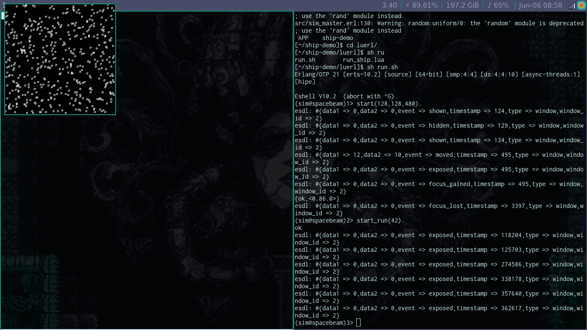
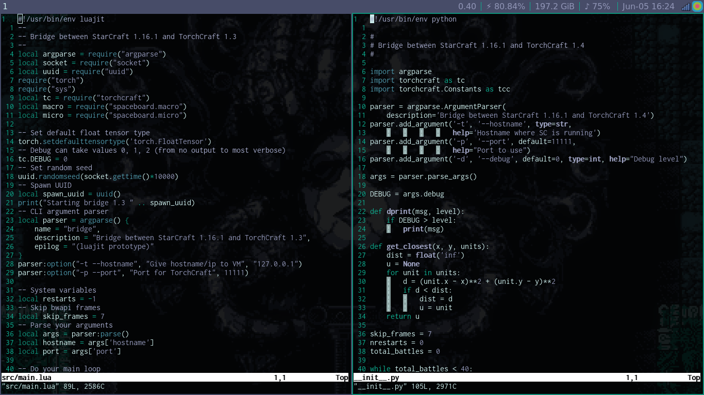
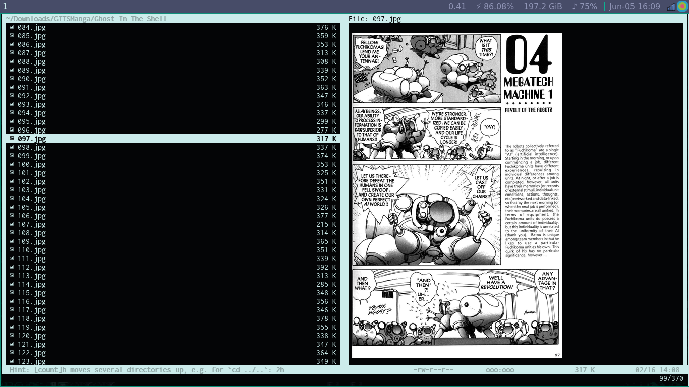

# Spacebeam

Spacebeam is an custom Debian stable (x86_64) distribution that enables end users easily build computational clusters, grid endpoints and visualization on tiled-displays; installation and support is also available from community members.

## Core ideas
- Functions are a form of objects.
- Message passing and function calling are analogous.
- Asynchronous message passing is necessary for non-blocking systems.
- Selective receive allow to ignore messages uninteresting now.

## Screenshots

